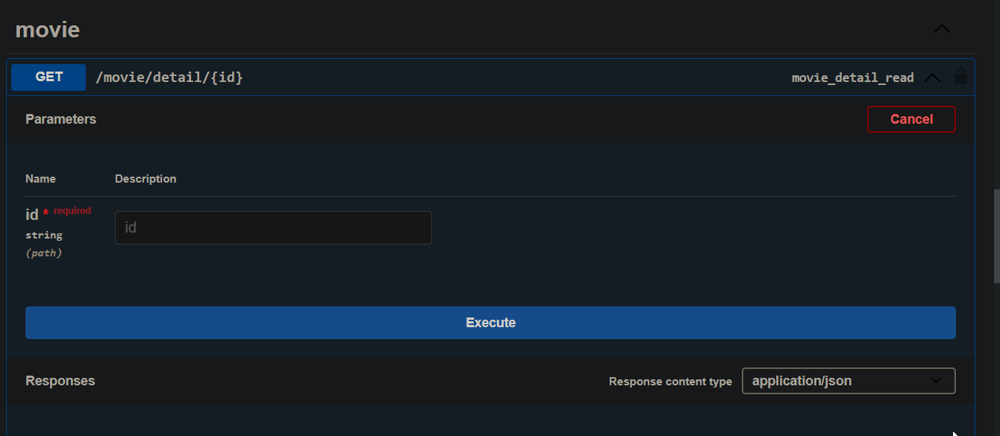
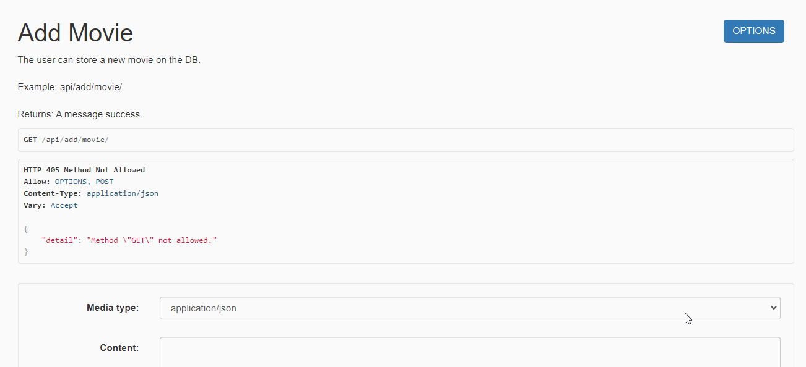
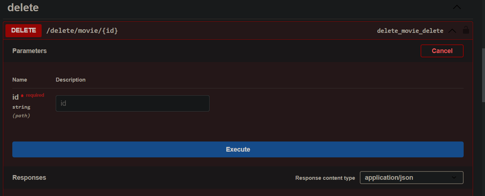
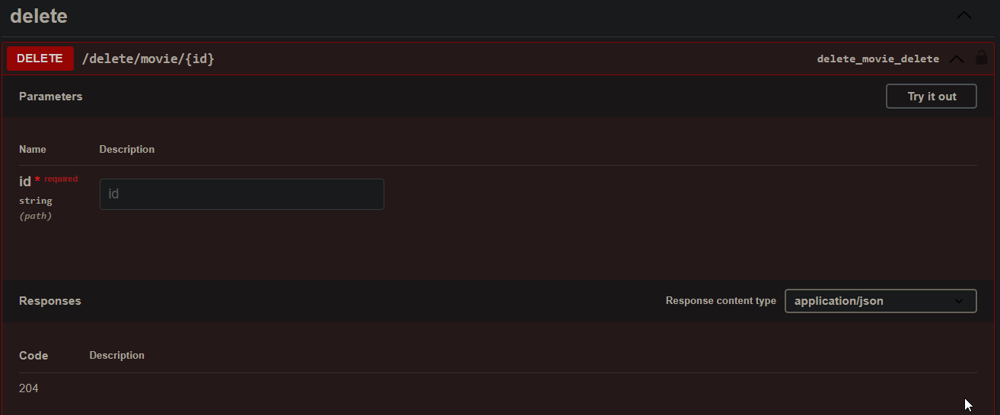

## Movies API REST

API basada en la arquitectura REST, la cual permite listar diferentes películas, agregar reseñas y almacenar las películas favoritas del usuario. La API cuenta con un sistema de autenticación (Registro, login, logout y restablecimiento de contraseñas), además otorga diferentes permisos a los usuarios para acceder a los endpoints, desarrollada con Django Rest Framework.


## Tecnologías usadas

- Python versión 3.8.5
- Django rest framework versión 3.14.0
- IDE (Visual studio code)
- GIT versión 2.37.2.windows.2


## Instalación

1. Clona este repositorio: `https://github.com/AndresSilverall/movies-api.git`
2. Navega a la carpeta del proyecto: `cd movies-api`
3. Ejecuta un entorno virtual de Python para la ejecución de la API


### Instalar un entorno virtual en Python 

- Instalar desde el gestor de paquetes de Python: `pip install pipenv`.
- Crear un entorno virtual: `pipenv install`.
- Una vez ya creado el entorno virtual con `pipenv install` se instalará todas las dependencias necesarias para la API alojadas en el archivo `Pipfile`.
- Activar entorno virtual: `pipenv shell`.
- Para salir del entorno virtual: `exit`.


4. Ejecuta el servidor de desarrollo: `python manage.py runserver`
5. Abre tu navegador y ve al siguiente endpoint: `http://127.0.0.1:8000/api/movies`


### Atajos de comandos dentro del entorno virtual

```python
server = "python manage.py runserver 127.0.0.1:8000"
make = "python manage.py makemigrations"
migrate = "python manage.py migrate"
test = "python manage.py test"

```

- Ejecutar servidor `pipenv run server`
- Realizar migraciones de los modelos `pipenv run make`
- Migrar modelos `pipenv run migrate`
- Ejecutar pruebas de software con Unit testing `pipenv run test`


## Documentación de la API REST

La Documentación de la API se implementó con Swagger, para acceder a la documentación acceda al siguiente recurso: `/api/doc/` una vez levantado el servidor.

## Métodos HTTP establecidos para los endpoints
<br>
<table style="border-collapse: collapse; width: 100%;">
    <tr>
      <td style="border: 1px solid black;">Método</td>
      <td style="border: 1px solid black;">Descripción </td>
    </tr>
    <tr>
      <td style="border: 1px solid black;"><code>GET</code></td>
      <td style="border: 1px solid black;">Obtener todas las películas almacenadas en la BD.</td>
    </tr>
    <tr>
      <td style="border: 1px solid black;"><code>GET</code></td>
      <td style="border: 1px solid black;">Obtener detalles de una película.</td>
    </tr>
      <tr>
      <td style="border: 1px solid black;"><code>GET</code></td>
      <td style="border: 1px solid black;">Obtener las reseñas de las películas.</td>
    </tr>
    <tr>
      <td style="border: 1px solid black;"><code>POST</code></td>
      <td style="border: 1px solid black;">Agregar una nueva película a la BD.</td>
    </tr>
      <tr>
      <td style="border: 1px solid black;"><code>POST</code></td>
      <td style="border: 1px solid black;">Agregar reseñas a diferentes películas.</td>
    </tr>
        <tr>
      <td style="border: 1px solid black;"><code>POST</code></td>
      <td style="border: 1px solid black;">Agregar película favorita.</td>
    </tr>
    <tr>
      <td style="border: 1px solid black;"><code>POST</code></td>
      <td style="border: 1px solid black;">Registro de usuario.</td>
    </tr>
    <tr>
      <td style="border: 1px solid black;"><code>POST</code></td>
      <td style="border: 1px solid black;">Login de usuario.</td>
    </tr>
      <tr>
      <td style="border: 1px solid black;"><code>POST</code></td>
      <td style="border: 1px solid black;">Cambiar contraseña.</td>
    </tr>
        <tr>
      <td style="border: 1px solid black;"><code>POST</code></td>
      <td style="border: 1px solid black;">Cerrar sesión.</td>
    </tr>
    <tr>
      <td style="border: 1px solid black;"><code>PUT</code></td>
      <td style="border: 1px solid black;">Actualizar los detalles de una película.</td>
    </tr>
    <tr>
      <td style="border: 1px solid black;"><code>DELETE</code></td>
      <td style="border: 1px solid black;">Eliminar una película con la ID (Primary key).</td>
    </tr>
  </table>
  <br>
 

 ## Demo de la API desde Swagger

 #### Obtener todas las películas almacenadas en la BD
 
 Endpoint: `/api/movies/`

 


#### Obtener detalles de una película en específico

Endpoint: `/api/movie/detail/6`




#### Agregar película (autenticación requerida)

Endpoint: `/api/add/movie/`




#### Eliminar una película en específico (autenticación requerida)

Endpoint: `/api/delete/movie/2`

#### Sin autenticación



##### Con autenticación

Endpoint: `/api/delete/movie/2`

